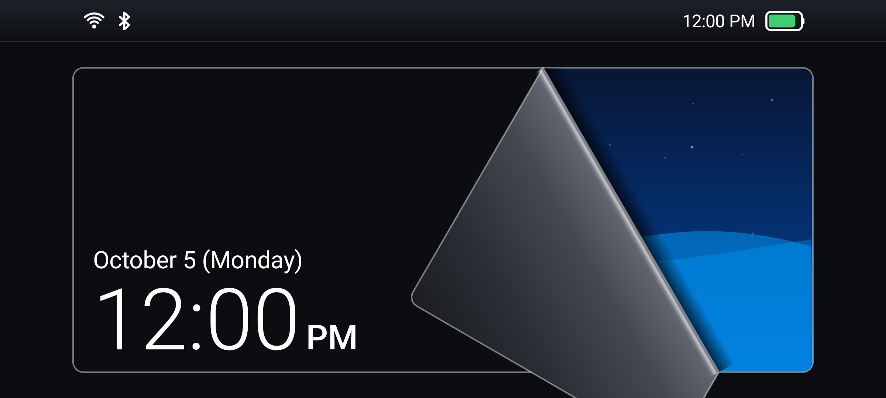
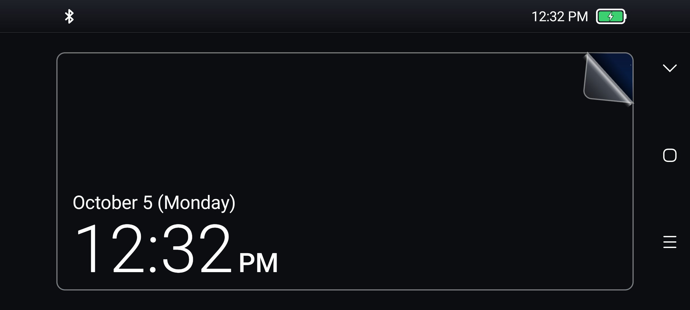
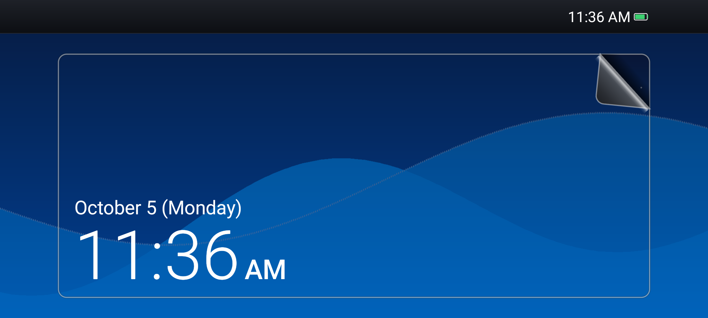
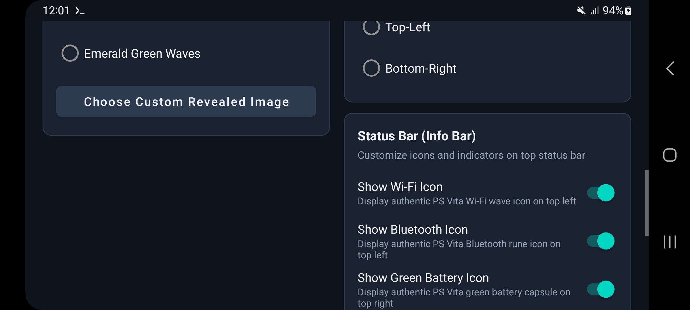
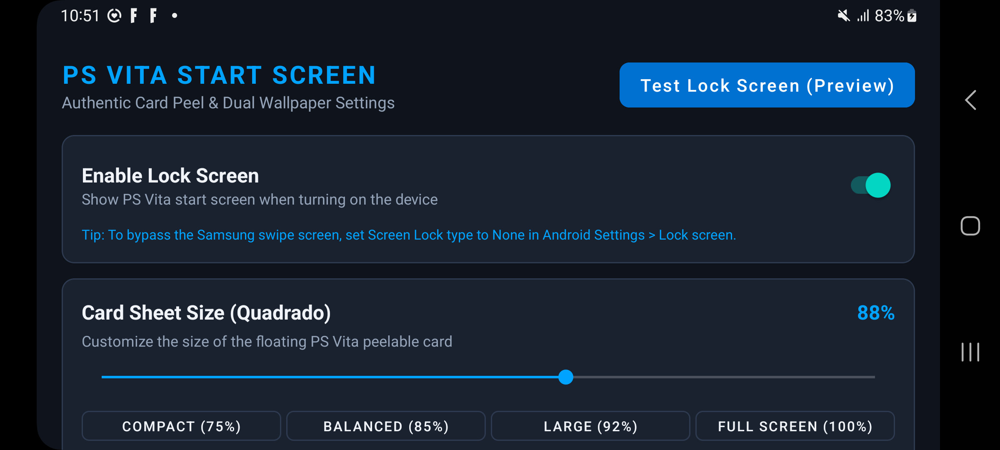
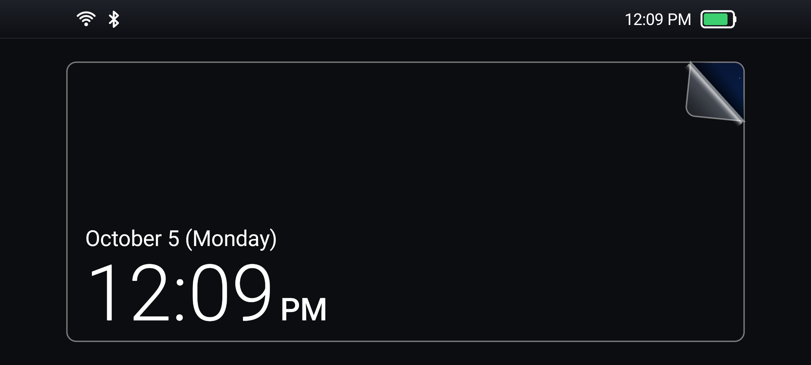

# PS Vita Lock Screen for Android

<p align="center">
  
</p>

An authentic recreation of the iconic **PlayStation Vita Start Screen (Lock Screen)** for Android smartphones and tablets. Experience the satisfying interactive corner peel, dynamic Sony-style Info Bar, dual-layer wallpaper reveal, and complete customization.

Tested and optimized for **Samsung Galaxy S20 FE**, **Galaxy A34**, and other modern Android devices.

---

## 📸 Screenshots

| Interactive Peel Physics | Authentic Cutout Groove & Charging Battery |
| :---: | :---: |
|  |  |
| *Smooth sheet curl with real-time lighting and drop shadow* | *Real-time battery capsule with lightning bolt charging indicator* |

| Crystal Blue Waves Theme | Status Bar & Wallpaper Customization |
| :---: | :---: |
|  |  |
| *Iconic PS Vita wave themes with crisp typography* | *Toggle individual status bar icons & select dual wallpapers* |

| Card Sheet Size Customization | Live Hardware Status (Wi-Fi & Bluetooth) |
| :---: | :---: |
|  |  |
| *Adjustable card size slider with quick presets* | *Dynamic indicators reflecting real device hardware states* |

---

## ✨ Features

- **🎮 Authentic Peel-to-Unlock Physics**:
  - Touch and drag the top-right corner to peel back the screen like a physical film sheet.
  - Realistic curl curvature, backside gradient shading, and dynamic drop shadow cast onto the revealed wallpaper.
  - Smooth release animation: snaps back if released early, smoothly slides off-screen when threshold is reached.

- **⚡ Dynamic Real-Time Info Bar (Status Bar)**:
  - **Battery Capsule**: Displays actual device battery percentage in an authentic green capsule. Shows a crisp white **charging lightning bolt** inside whenever the device is plugged in.
  - **Wi-Fi Indicator**: Dynamic PS Vita Wi-Fi wave icon appearing automatically when connected to a Wi-Fi network.
  - **Bluetooth Indicator**: Authentic PS Vita Bluetooth rune icon appearing when Bluetooth is turned ON.
  - **Clock & Date**: High-definition PS Vita typography in 12h or 24h format with customizable positioning.
  - **Fully Configurable**: Toggle any status bar element on or off in settings.

- **📐 Customizable Card Sheet Size**:
  - Adjustable card size slider ranging from 50% to 100%.
  - Quick presets: **Compact (75%)**, **Balanced (85%)**, **Large (92%)**, and **Full Screen (100%)**.
  - Delicate metallic groove contour outlining the card against the background, faithfully replicating the original PS Vita start screen frame.

- **🖼️ Dual Wallpaper Engine**:
  - Independent **Front Card Wallpaper** (peelable sheet) and **Revealed Wallpaper** (underneath).
  - Built-in classic PS Vita wave presets:
    - *Onyx Black*
    - *Crystal Blue Waves*
    - *Cosmic Red Waves*
    - *Emerald Green Waves*
  - Support for custom photos and wallpapers from your gallery for both layers.

- **📱 Edge-to-Edge Immersive Experience**:
  - Full-screen immersion hiding native Android status bars and navigation buttons during lock screen view.
  - Horizontal landscape lock screen orientation for true console feel.
  - Foreground service ensuring instant screen presentation when the device is woken up.

---

## 🚀 Installation & Getting Started

### 1. Download the APK
Download the latest `PS-Vita-LockScreen-v1.2.0.apk` directly from the [**GitHub Releases**](https://github.com/Nycolazs/PS-Vita-Lock-Screen/releases) page.

### 2. Install on Android
1. Open the downloaded APK on your device.
2. If prompted, grant permission to **Install Unknown Apps** from your browser or file manager.
3. Open the **PS Vita Lock Screen** app.

### 3. Grant Permissions
- **Display over other apps**: Required to display the lock screen over the lock window.
- **Ignore Battery Optimizations**: Recommended so Android does not kill the lock screen listener in deep sleep.

### 4. Recommended Setup for Samsung Galaxy (One UI) / Android
To enjoy the true PS Vita lock screen experience without the Samsung default swipe screen interfering:
1. Open your phone's **Settings** > **Lock screen**.
2. Tap **Screen lock type** and select **None** (or **Swipe** if you don't use biometric security).
3. In the PS Vita Lock Screen app, toggle **Enable Lock Screen** to **ON**.
4. Tap **Test Lock Screen (Preview)** to test the lock screen immediately.

---

## 🛠️ Building from Source

### Prerequisites
- Android Studio Hedgehog or newer
- JDK 17
- Android SDK Platform 34

### Build Steps
```bash
# Clone the repository
git clone https://github.com/Nycolazs/PS-Vita-Lock-Screen.git
cd PS-Vita-Lock-Screen

# Build Debug APK
./gradlew assembleDebug

# The APK will be available at:
# app/build/outputs/apk/debug/app-debug.apk
```

---

## 📂 Project Architecture

```
app/src/main/java/com/psvita/lockscreen/
├── MainActivity.kt               # Settings UI & customization dashboard
├── LockScreenActivity.kt         # Edge-to-edge lock screen presentation container
├── LockScreenService.kt          # Background receiver listening for SCREEN_ON / SCREEN_OFF
├── preferences/
│   └── LockPreferences.kt       # Persistent configuration storage (SharedPreferences)
├── views/
│   ├── VitaPeelView.kt           # Custom peel physics engine, curl mesh, and wallpaper rendering
│   └── VitaInfoBarView.kt        # Real-time hardware status bar (Battery, Wi-Fi, Bluetooth, Clock)
└── wallpapers/
    └── BuiltInWallpapers.kt      # Vector & gradient generators for authentic PS Vita wave themes
```

---

## 📄 License
This project is licensed under the MIT License - see the LICENSE file for details.
PlayStation and PS Vita are registered trademarks of Sony Interactive Entertainment Inc. This project is an independent fan recreation and is not affiliated with or endorsed by Sony.
